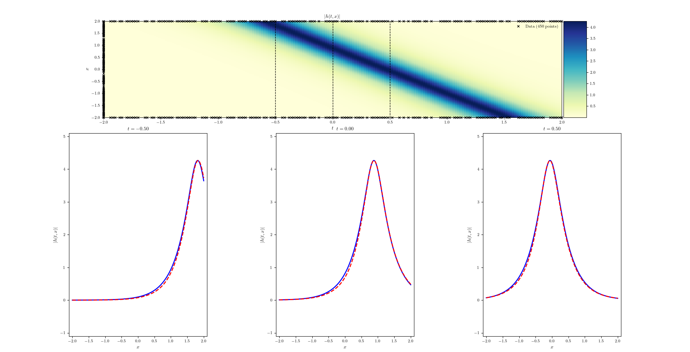

# Physics-Informed Neural Networks (PINNs)

This repository provides implementations of the Physics-Informed Neural Network (PINN) method, originally proposed in the 2017 paper "Physics-Informed Machine Learning" by Raissi, Perdikaris, and Karniadakis. The method is reproduced in both TensorFlow and PyTorch frameworks, enabling flexibility and accessibility for researchers and practitioners.

## Table of Contents

- [Introduction](#introduction)
- [Features](#features)
- [Installation](#installation)
- [Usage](#usage)
- [Examples](#examples)
- [Results](#results)
- [Contributing](#contributing)
- [License](#license)

## Introduction

Physics-Informed Neural Networks (PINNs) are a powerful approach that incorporates the governing physical laws, expressed as partial differential equations (PDEs), into the training of neural networks. By embedding physical constraints into the loss function, PINNs enable data-driven solution of PDEs without requiring large datasets or explicit numerical discretization methods.

This repository implements the PINN framework to solve PDEs using both TensorFlow and PyTorch, demonstrating its flexibility and application to various scientific problems.

## Features

- Implementations in **TensorFlow** and **PyTorch**.
- Generalized structure for solving PDEs.
- Customizable loss functions incorporating PDE residuals.
- Support for various boundary and initial conditions.
- Reproducible and validated results from the original paper.

## Installation

### Clone the Repository

```bash
git clone https://github.com/<your-username>/PINN-with-TF-and-Pytorch.git
cd PINN-with-TF-and-Pytorch
```

### Dependencies

Install the required Python packages:

```bash
pip install -r requirements.txt
```

The `requirements.txt` file includes:

- TensorFlow = 1.15 (Recommend)
- PyTorch = 1.18 (Recommend)
- NumPy
- Matplotlib

## Usage

### Running TensorFlow Implementation

```bash
cd Tensorflow
python TF_NS_Soliton.py
```

### Running PyTorch Implementation

```bash
cd Pytorch
python main_for_rawPINN.py
```

### Configurations

- Modify the PDE, boundary conditions, and neural network parameters in the respective `TF_NS_Soliton.py` or `main_for_rawPINN.py` scripts.

## Examples

This repository includes examples for solving the following PDEs:

1. **Nonlinear Schrödinger Equation (Soliton Solution)**
2. **Generalized Gardner equation (Dispersion shock wave)**

## Results

The solutions obtained using PINNs closely match the analytical or numerical solutions of the PDEs. Below is a sample comparison for the 1D Burgers' equation:



## Contributing

Contributions are welcome! If you find a bug or want to add new features, feel free to open an issue or submit a pull request. Ensure your code is well-documented and includes test cases for any new functionality.

## License

This repository is licensed under the MIT License. See the [LICENSE](LICENSE) file for details.

---

**Contact**
For any questions or feedback, feel free to reach out via the GitHub repository or email at <wy524@ic.ac.uk>.
